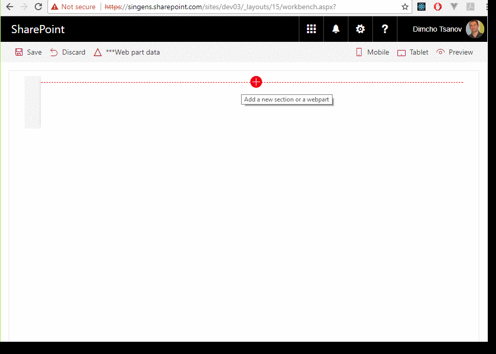

# Documents Web Part

## Summary

This sample shows how to build web parts that display documents in accordance with the SharePoint Online modern experience. The code uses Office UI Fabric components on the top of SharePoint framework. The web parts implement filtering and sorting. Two data source approaches are demonstrated: items retrieved from the search index and real-time query to a document library.

## Compatibility

-Incompatible-red.svg> "SharePoint Server 2016 Feature Pack 2 requires SPFx 1.1")

## Applies to

- [SharePoint Framework](https://docs.microsoft.com/sharepoint/dev/spfx/sharepoint-framework-overview)
- [Office 365 tenant](https://docs.microsoft.com/sharepoint/dev/spfx/set-up-your-development-environment)

## Prerequisites

- Office 365 subscription with SharePoint Online.
- SharePoint Framework [development environment](https://docs.microsoft.com/sharepoint/dev/spfx/set-up-your-development-environment) already set up.

## Solution

| Solution               | Author(s)                                                                                               |
| ---------------------- | ------------------------------------------------------------------------------------------------------- |
| react-documents        | Dimcho Tsanov                                                                                           |
| react-documents (v2.0) | [Harsha Vardhini](https://github.com/Harshagracy) ([harshagracy](https://twitter.com/harshagracy?s=20)) |

## Version history

| Version | Date             | Comments        |
| ------- | ---------------- | --------------- |
| 1.0     | October 13, 2017 | Initial release |
| 2.0     | April 28, 2020   | Initial release |

## Minimal Path to Awesome

- Clone this repository
- in the command line run:
  - `npm install`
  - `gulp serve`

> This sample can also be opened with [VS Code Remote Development](https://code.visualstudio.com/docs/remote/remote-overview). Visit https://aka.ms/spfx-devcontainer for further instructions.

## Features

This Web Part illustrates the following concepts on top of the SharePoint Framework:

-Using React for building SharePoint Framework client-side web parts.
-Using Office UI Fabric React styles for building user experience consistent with SharePoint and Office.
-Using the SharePoint rest API for querying document library's files.
-Using the SharePoint rest API for retrieving documents from the search index.
-Passing web part properties to React components.
-Reusing single React component between two web parts.

## Help

We do not support samples, but this community is always willing to help, and we want to improve these samples. We use GitHub to track issues, which makes it easy for community members to volunteer their time and help resolve issues.

If you're having issues building the solution, please run [spfx doctor](https://pnp.github.io/cli-microsoft365/cmd/spfx/spfx-doctor/) from within the solution folder to diagnose incompatibility issues with your environment.

You can try looking at [issues related to this sample](https://github.com/pnp/sp-dev-fx-webparts/issues?q=label%3A%22sample%3A%20react-documents-detailslist%22) to see if anybody else is having the same issues.

You can also try looking at [discussions related to this sample](https://github.com/pnp/sp-dev-fx-webparts/discussions?discussions_q=react-documents-detailslist) and see what the community is saying.

If you encounter any issues while using this sample, [create a new issue](https://github.com/pnp/sp-dev-fx-webparts/issues/new?assignees=&labels=Needs%3A+Triage+%3Amag%3A%2Ctype%3Abug-suspected%2Csample%3A%20react-documents-detailslist&template=bug-report.yml&sample=react-documents-detailslist&authors=@Harshagracy&title=react-documents-detailslist%20-%20).

For questions regarding this sample, [create a new question](https://github.com/pnp/sp-dev-fx-webparts/issues/new?assignees=&labels=Needs%3A+Triage+%3Amag%3A%2Ctype%3Aquestion%2Csample%3A%20react-documents-detailslist&template=question.yml&sample=react-documents-detailslist&authors=@Harshagracy&title=react-documents-detailslist%20-%20).

Finally, if you have an idea for improvement, [make a suggestion](https://github.com/pnp/sp-dev-fx-webparts/issues/new?assignees=&labels=Needs%3A+Triage+%3Amag%3A%2Ctype%3Aenhancement%2Csample%3A%20react-documents-detailslist&template=suggestion.yml&sample=react-documents-detailslist&authors=@Harshagracy&title=react-documents-detailslist%20-%20).

## Disclaimer

**THIS CODE IS PROVIDED _AS IS_ WITHOUT WARRANTY OF ANY KIND, EITHER EXPRESS OR IMPLIED, INCLUDING ANY IMPLIED WARRANTIES OF FITNESS FOR A PARTICULAR PURPOSE, MERCHANTABILITY, OR NON-INFRINGEMENT.**

